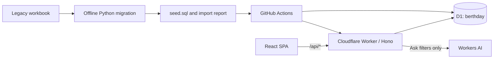

# Berthday

*Every vessel, the right berth, on the right day.*

Berthday is the dock scheduling application for Harborview Marine Research Center. It turns the supplied 1997–2019 workbook into searchable bookings while preserving the data problems and source cells for review. Coordinators can inspect the month, find a berth, manage bookings and vessel lengths, and resolve issues with server-enforced overlap, fit, and vessel-location rules.

Live application: [Berthday](https://berthday.bill-nguyentonhoang.workers.dev).

## Run locally

Use Node.js 22.12 or later and Python 3.12. GitHub Actions uses the latest Node.js 22 release. The supplied `Dock Schedule - Synthetic Sample (1).xlsx` is included as `data/dock_schedule.xlsx`; it is byte-identical to the other supplied copy without `(1)` in its name.

```sh
npm ci
python3.12 -m venv .venv
source .venv/bin/activate
pip install -r migration/requirements.txt
npm run migrate
npm run db:local
npm run build
npm run dev
```

Open the Vite URL printed in the terminal (normally `http://localhost:5173`). Vite proxies `/api` to the local Worker on port 8787. Build once before starting development so Wrangler has the static assets it expects. The local D1 database is isolated from Cloudflare; `npm run db:local` replaces its data with the original workbook seed.

The first schedule view opens December 2019, the last imported month. Use **Today** for the current month or **Latest data** to return to the imported data.

Bookings supports either selected dates or **All imported history**. History mode progressively searches 1997–2019 in bounded windows and shows each booking once, including stays that cross windows. Its CSV export includes every matching historical booking, even those not yet loaded in the table. Ask searches without explicit dates use this visible history mode.

## Validate

Run the Python tests first because they also generate the JSON fixtures used by the TypeScript/Python parity test.

```sh
source .venv/bin/activate
python -m pytest -q migration/tests
npm run typecheck
npm test
npm run build
```

The 13 migration golden tests cover formula date headers, invalid dates, copied Decembers, merged/coloured bars, duplicate berth rows, disputed lengths, and stable counts. `npm test` runs all three JavaScript suites:

- 75 shared-domain, date, Ask fallback, and Python-parity tests (`npm run test:unit`). The timezone is `America/New_York` to expose accidental local-time date math; parity compares all 48 Python issue records against TypeScript.
- 16 Worker API integration tests (`npm run test:api`) with the real local D1 runtime and an isolated fixture. They exercise guarded concurrent writes, conflicts and alternatives, fit/issue changes, reviews, legacy edits, long stays, vessel movement, pagination, validation, Ask fallback/AI response handling, long and multibyte search text, and CSV export.
- 6 D1 provisioning tests that verify reuse/creation and reject IDs belonging to another database.

The API pool is pinned to Vitest 4.1.11 with `@cloudflare/vitest-pool-workers` 0.22.0. Its bundled workerd supports a test compatibility date of `2026-08-22`; the deployed Worker retains `2026-09-01`. The Miniflare dependency uses the declared `sharp` 0.35.4 override so a clean `npm ci` reproduces the working runtime.

The local release check passed all **110 automated tests**, both TypeScript checks, and the production build. Browser checks covered all five pages at 390 px with no document overflow, historical vessel search, the seeded issue counts and highlighted source bookings, fit rejection and successful alternative booking, the Golden Compass length-change issue counts, availability, and Ask filters.

The initial live deployment (`APP_VERSION=initial-20260922`) also passed `smoke-test.sh` and 16 live API checks covering imported schedule data, issue counts, availability, validation/alternatives, temporary booking writes, Ask fallback, and routing. The temporary booking was removed: the remote database returned to 2,587 imported reservations, zero app-created reservations, and 48 schedule issues. Live browser verification at 1280 px confirmed no document overflow, the default December 2019 view with nine booking bars, seven vessels, 17% occupancy and zero issues that month, plus direct loading of `/issues` with the 4/29/15 category counts.

GitHub Actions has not run for this release, and its Cloudflare repository secrets are not configured. The confirmed deployment used the authenticated local Cloudflare CLI; configure the documented secrets to enable automated deployments.

To regenerate committed Worker environment types after changing bindings, run `npm run cf-typegen`.

## Architecture



`shared/` contains UTC date helpers, schemas, and business rules used by the UI and authoritative Worker. `worker/db.ts` owns SQL and maps storage fields to API DTOs. The React SPA is served by the same Worker; `/api/*` always reaches the Worker before the SPA fallback. An unknown API route returns JSON, while browser routes such as `/issues` support direct loads.

The Ask bar produces visible, editable filters. It uses Workers AI when available and a deterministic parser when the binding is unavailable or the model fails; availability and booking validation always use the same deterministic domain rules.

## Migration

The migration and its golden tests are copied verbatim from Appendices A and B of [PRD.md](PRD.md). The schema is copied verbatim from section 7. The fixed generation timestamp makes the seed reproducible, and `migration/out/` stays out of Git.

The extractor finds month blocks, derives the year from the sheet name, and identifies day 1 by voting over numeric headers, including formula and split headers. It resolves Excel fills and merged cells into bars, adopts names in the middle of a bar, records timing/service text as notes, and stitches stays across month and year boundaries. It compares and skips copied Decembers, retains unlabelled booking rows in an unassigned resource, reads vessel lengths from Science/Yachts, and flags every uncertain interpretation with a source reference.

| Imported data | Count |
| --- | ---: |
| Reservations | 2,587 |
| Vessel bookings / events / closures / holds | 2,047 / 89 / 49 / 402 |
| Vessels | 635 |
| Known / disputed / missing lengths | 159 / 5 / 471 |
| Resources | 9 |
| Double-bookings / fit issues / vessel in two places | 4 / 29 / 15 |
| Migration log entries | 680 |

The data spans **1 August 1997–31 December 2019**; the longest legacy stay is **425 days**. New bookings are limited to 366 inclusive days. Existing legacy problems stay visible; importing the history does not silently move, shorten, or discard those bookings.

## Deploy with GitHub Actions

The repository's `main` branch runs `.github/workflows/deploy.yml`. Pull requests run the checks without deploying. Configure these repository secrets:

| Secret | Value |
| --- | --- |
| `CLOUDFLARE_API_TOKEN` | A scoped token using the Edit Cloudflare Workers template, with Account → D1 → Edit and Account → Workers AI → Read when those are not included. |
| `CLOUDFLARE_ACCOUNT_ID` | The Cloudflare account that will own Berthday. |
| `D1_DATABASE_ID` | Optional UUID of an existing database **named `berthday`**. |

Configure a `workers.dev` subdomain once in the account's Workers dashboard. The deployed Worker is named `berthday`, so its public URL is `https://berthday.<subdomain>.workers.dev`.

The test job runs Python golden tests, generates the seed, runs all unit, parity, Worker API, and provisioning tests plus type checks, and builds the SPA. The deploy job downloads that seed, resolves or creates D1, applies schema migrations, seeds only an empty database, builds the assets, and deploys. `APP_VERSION` is set to the seven-character Git SHA. The smoke test verifies that version, seeded metadata, the home page, direct `/issues` navigation, and JSON 404s; the successful URL appears in the workflow summary.

If `D1_DATABASE_ID` is omitted, `scripts/ci/ensure-d1.mjs` reuses the account's database named `berthday` or creates it on first deployment. If an ID is supplied, the script verifies it exists in that account and is named exactly `berthday` before touching the config or database. An all-zero UUID in `wrangler.jsonc` is a local placeholder replaced in the CI workspace; a real D1 ID is also safe to commit.

### Reseed

Normal deployments preserve app-created bookings, edits, and reviewed issues. To intentionally restore the original workbook, run **Actions → Test and deploy Berthday → Run workflow** on `main` and select `reseed`. This replaces all application data, including bookings added in the app and issue review notes. Keep reseeding manual and at most once per day on the D1 free plan.

### Deploy from the local CLI

The CLI can use an existing Cloudflare OAuth login or the `CLOUDFLARE_API_TOKEN` / `CLOUDFLARE_ACCOUNT_ID` environment variables. Check the selected account with `npx wrangler whoami`; use `npx wrangler login` if needed. Local OAuth does not configure GitHub Actions secrets, which must be added separately before the automated deploy job can succeed.

After generating the seed and passing the checks:

```sh
node scripts/ci/ensure-d1.mjs
npx wrangler d1 migrations apply berthday --remote
bash scripts/ci/seed-if-empty.sh
npm run build
npx wrangler deploy --var APP_VERSION:$(git rev-parse --short=7 HEAD)
```

Use `bash scripts/ci/smoke-test.sh 'https://berthday.<subdomain>.workers.dev'` with the actual deployed URL to verify health, seeded metadata, SPA routing, and the API 404 response. Walk the demo below separately for browser acceptance.

The manual seed command has the same empty-database guard. Set `FORCE_RESEED=true` only when intentionally resetting the remote database.

## 60-second demo

1. Open the schedule: December 2019 is already populated. Jump to March 2010 to see R/V Golden Compass at North Pier West on 4–26 March.
2. Open **Issues** and inspect the 4 double-bookings, 29 fit issues, and 15 vessel-location issues. Show the South Float East issue on 11 July 2017 to see both bookings and their source cells.
3. Create M/Y Wild Tern (145 ft) at South Float East (90 ft), 3–10 July 2026. The server names both lengths and offers North Pier East or North Pier West; choose an alternative and save.
4. Try a second vessel on the same berth and dates. Inspect the conflict and suggested date shift.
5. In **Vessels**, change R/V Golden Compass to 300 ft to create 23 fit issues, then to 200 ft to clear those 23.
6. Use **Find a berth** for 120 ft, 1–7 August 2026. North Pier East and North Pier West fit; shorter berths are visibly marked.
7. Open **Migration** for the 2,587 imported reservations and grouped review log. Ask “which berths fit a 120 ft boat 3–10 July 2026” to apply the same availability search through visible filters.

See [DECISIONS.md](DECISIONS.md) for assumptions, tradeoffs, and questions for the dock coordinator.
