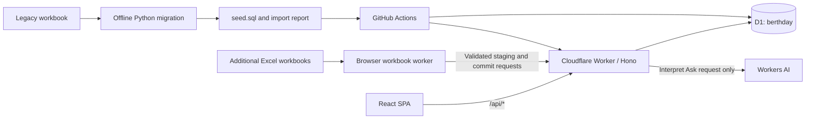

# Berthday

*Every vessel, the right berth, on the right day.*

Berthday is the dock scheduling application for Harborview Marine Research Center. It turns the supplied 1997–2019 workbook into searchable bookings while preserving the data problems and source cells for review. Coordinators can inspect the month, find a berth, manage bookings and vessel lengths, add resources, and import more Excel schedules. New bookings use server-enforced overlap, fit, and vessel-location rules; imported history retains its conflicts for review.

Live application: [Berthday](https://berthday.bill-nguyentonhoang.workers.dev).

## Run locally

Use Node.js 22.12 or later and Python 3.12. GitHub Actions uses the latest Node.js 22 release. The supplied `Dock Schedule - Synthetic Sample (1).xlsx` is included as `data/dock_schedule.xlsx`; it is byte-identical to the other supplied copy without `(1)` in its name.

```sh
npm ci
python3.12 -m venv .venv
source .venv/bin/activate
pip install -r migration/requirements.txt
npm run migrate
npm run db:local
npm run build
npm run dev
```

Open the Vite URL printed in the terminal (normally `http://localhost:5173`). Vite proxies `/api` to the local Worker on port 8787. Build once before starting development so Wrangler has the static assets it expects. The local D1 database is isolated from Cloudflare; `npm run db:local` replaces its data with the original workbook seed.

The first schedule view opens the latest recorded month, December 2019 in the original seed. Use **Today** for the current month or **Latest data** to return to the newest recorded data.

Bookings supports either selected dates or **All imported history**. History mode progressively searches the recorded date range in bounded windows and shows each booking once, including stays that cross windows. Its CSV export includes every matching historical booking, even those not yet loaded in the table. This list remains available independently of the schedule’s Ask bar.

## Berths and shared resources

Use the **+** button in the schedule's resource column to add a berth or shared resource without leaving the grid. The popup lets you name the resource, choose its type, and enter the berth's capacity. **Resources** provides the full catalogue and the same creation form.

A dedicated berth needs a whole-number maximum vessel length from 1 to 1,000 ft and permits one booking at a time. A shared resource permits overlapping bookings and has no fixed length limit. The vessel-location rule still applies across resources. New resources appear in the schedule, booking forms, availability results, and workbook imports.

Resource names are unique regardless of case. Use the same name in your workbook, and add new resources before preparing an import. The existing Unassigned resource is reserved for imported history. This page adds resources; it does not edit or delete existing ones.

## Import Excel schedules

Open **Imports → Upload Excel**, then choose files, choose a folder, or drop workbooks onto the page. The importer supports the existing dock-grid layout: annual sheets named by year, month headings in column A, numeric day headings, and labelled resource rows with merged or coloured booking bars. Science/Yachts reference sheets supply vessel lengths. Save older `.xls` files as `.xlsx`; `.xlsx` and `.xlsm` are supported, and macros are not executed.

1. Select **Prepare files**. Workbooks are read one at a time in a background browser worker. Only extracted records, source references, and diagnostics are sent to the server; the original files stay on your computer.
2. Select **Review prepared records** to inspect the preview and source notes. Preparation does not add reservations to the schedule.
3. Select **Import records**. Progress is saved in small atomic batches. New bookings appear in the schedule and Bookings list; imported overlaps, fit violations, and vessel-location conflicts appear in Issues.
4. Download the import report to review file results, duplicates, and invalid-record counts.

Imports add data without overwriting existing bookings or vessel facts. Previously completed copies are skipped by file hash, and matching bookings are skipped independently of filename or source cell. Invalid records are reported and skipped; valid historical conflicts are retained. A workbook that has no readable booking or vessel-reference records reports an error.

When a workbook repeats December from the prior year, the original year’s month takes precedence if present. If the original month is absent from that workbook, the copy is retained and flagged for review. Unknown resource labels are reported so missing resources can be added before another import.

Use **Pause** to resume later. If preparation was interrupted, reopen the saved import and reselect the same files; received batches are checked and reused. Once preparation is complete, **Resume import** needs no original files. **Stop import** ends that job. Records already committed remain saved, and a new import of the files skips those existing records.

Each selection supports up to **5,000 workbooks**, **25 MB per file**, and **100,000 extracted records per workbook**. Expansion, worksheet, cell, and parsing-time limits also apply, with a specific error when a workbook exceeds them. Keep the page open while work is running. Cloudflare service quotas can pause a large import; progress remains available to resume when service is restored. D1's Free plan includes 100,000 written rows per day, and staging and index updates also consume writes. [D1 usage limits](https://developers.cloudflare.com/d1/platform/pricing/)

## Ask and schedule filters

Type a schedule question and pause briefly. Ask automatically filters or navigates the schedule after about 400 ms; pressing Enter or the arrow button runs the request immediately. There is no Apply step or redirect to the Bookings list. Changing the text cancels the previous request so an older response cannot replace the latest filters. Clearing the input removes the filters and keeps the month currently on screen.

A request for a year such as “show all bookings in 2000” opens January 2000 with a visible 1 January–31 December range chip; month arrows keep that range and stop at its ends. A deliberate month-picker, Today, or Latest data selection clears the date range while retaining berth, vessel, kind, and issue filters.

The URL stores the active filters, so a filtered view can be bookmarked or shared. Remove any chip to update the grid immediately, or select Clear filters. Multiple values within a filter are included; different filter fields narrow the results together. Bars are clipped to the selected days, but their drawer retains the original booking dates and source. Filtered counts and occupancy describe the matching bookings; hidden bookings can still occupy the berth.

Ask can also prepare a new booking, for example “Create a community sail day at North Pier Face on July 10, 2026” or “book R/V Clear Tern at North Pier East from 3 to 10 July 2026.” For a creation request, press Enter or the arrow button to open one editable draft; typing alone does not open the draft or write a reservation. Missing or ambiguous required details remain blank for the coordinator to complete. Only **Save booking** sends the authoritative validation request; a successful save returns to the schedule and focuses the saved booking.

## Validate

Run the Python tests first because they also generate the JSON fixtures used by the TypeScript/Python parity test.

```sh
source .venv/bin/activate
python -m pytest -q migration/tests
npm run typecheck
npm test
npm run build
```

The 13 original migration golden tests cover formula date headers, invalid dates, copied Decembers, merged/coloured bars, duplicate berth rows, disputed lengths, and stable counts. Six additional seed safeguard cases check that normal deployments preserve existing resources and import history, and that an explicit reset clears import records and rebuilds duplicate keys without foreign-key errors. These Python tests also use Node.js to exercise the deployment script. `npm test` runs all three JavaScript suites:

- Shared-domain, date, Ask fallback and command routing, schedule-filter, workbook-parser, and Python-parity tests (`npm run test:unit`). The timezone is `America/New_York` to expose accidental local-time date math; parity compares all 48 Python issue records against TypeScript and the browser parser's records against the supplied workbook migration.
- Worker API integration tests (`npm run test:api`) with the real local D1 runtime and isolated fixtures. They exercise guarded concurrent writes, conflicts and alternatives, fit/issue changes, reviews, legacy edits, long stays, vessel movement, resource creation, resumable imports and duplicate detection, pagination, validation, Ask fallback/AI response handling, long and multibyte search text, and CSV export.
- D1 provisioning tests that verify reuse/creation and reject IDs belonging to another database.

The API pool is pinned to Vitest 4.1.11 with `@cloudflare/vitest-pool-workers` 0.22.0. Its bundled workerd supports a test compatibility date of `2026-08-22`; the deployed Worker retains `2026-09-01`. The Miniflare dependency uses the declared `sharp` 0.35.4 override so a clean `npm ci` reproduces the working runtime.

The initial release’s local check passed all **110 automated tests**, both TypeScript checks, and the production build. Browser checks covered all five pages at 390 px with no document overflow, historical vessel search, the seeded issue counts and highlighted source bookings, fit rejection and successful alternative booking, the Golden Compass length-change issue counts, availability, and Ask filters.

The schedule/Ask update passed **188 automated tests** (146 unit, 23 Worker API, 6 provisioning, and 13 migration), both TypeScript checks, and the production build. Browser checks verified one-submit navigation to January 2000, automatic year/berth/event filtering and removable chips, event draft/save/focus, conflict alternatives, blank missing fields, and the schedule and booking form at 390 px without document overflow. The temporary local event was removed after verification.

The initial live deployment (`APP_VERSION=initial-20260922`) also passed `smoke-test.sh` and 16 live API checks covering imported schedule data, issue counts, availability, validation/alternatives, temporary booking writes, Ask fallback, and routing. The temporary booking was removed: the remote database returned to 2,587 imported reservations, zero app-created reservations, and 48 schedule issues. Live browser verification at 1280 px confirmed no document overflow, the default December 2019 view with nine booking bars, seven vessels, 17% occupancy and zero issues that month, plus direct loading of `/issues` with the 4/29/15 category counts.

The initial GitHub Actions test job passed. Its deployment job failed because the repository lacks `CLOUDFLARE_API_TOKEN` and `CLOUDFLARE_ACCOUNT_ID` secrets. The confirmed live application was deployed manually through authenticated Wrangler OAuth; configure those secrets to enable automated deployments.

To regenerate committed Worker environment types after changing bindings, run `npm run cf-typegen`.

## Architecture



`shared/` contains UTC date helpers, schemas, and business rules used by the UI and authoritative Worker. `worker/db.ts` owns SQL and maps storage fields to API DTOs. The React SPA is served by the same Worker; `/api/*` always reaches the Worker before the SPA fallback. An unknown API route returns JSON, while browser routes such as `/issues` support direct loads.

The Ask bar translates requests into visible schedule filters or an editable booking draft. It uses Workers AI when available and a deterministic parser when the binding is unavailable or the model fails. The interpretation step does not write bookings; availability and Save booking always use the same deterministic domain rules.

## Migration

The original workbook extraction rules and 13 golden tests come from Appendices A and B of [PRD.md](PRD.md) and remain unchanged. Seed generation now clears import history and duplicate keys when a reset is explicitly requested. The initial schema is copied verbatim from section 7; additive migrations introduce resumable import jobs and duplicate tracking while preserving existing records. The fixed generation timestamp makes the original seed reproducible, and `migration/out/` stays out of Git. The original migration report remains available from **Imports → Original migration**.

The extractor finds month blocks, derives the year from the sheet name, and identifies day 1 by voting over numeric headers, including formula and split headers. It resolves Excel fills and merged cells into bars, adopts names in the middle of a bar, records timing/service text as notes, and stitches stays across month and year boundaries. It compares and skips copied Decembers, retains unlabelled booking rows in an unassigned resource, reads vessel lengths from Science/Yachts, and flags every uncertain interpretation with a source reference.

| Original seed data | Count |
| --- | ---: |
| Reservations | 2,587 |
| Vessel bookings / events / closures / holds | 2,047 / 89 / 49 / 402 |
| Vessels | 635 |
| Known / disputed / missing lengths | 159 / 5 / 471 |
| Resources | 9 |
| Double-bookings / fit issues / vessel in two places | 4 / 29 / 15 |
| Migration log entries | 680 |

The data spans **1 August 1997–31 December 2019**; the longest legacy stay is **425 days**. New bookings are limited to 366 inclusive days. Existing legacy problems stay visible; importing the history does not silently move, shorten, or discard those bookings.

## Deploy with GitHub Actions

The repository's `main` branch runs `.github/workflows/deploy.yml`. Pull requests run the checks without deploying. Configure these repository secrets:

| Secret | Value |
| --- | --- |
| `CLOUDFLARE_API_TOKEN` | A scoped token using the Edit Cloudflare Workers template, with Account → D1 → Edit and Account → Workers AI → Read when those are not included. |
| `CLOUDFLARE_ACCOUNT_ID` | The Cloudflare account that will own Berthday. |
| `D1_DATABASE_ID` | Optional UUID of an existing database **named `berthday`**. |

Configure a `workers.dev` subdomain once in the account's Workers dashboard. The deployed Worker is named `berthday`, so its public URL is `https://berthday.<subdomain>.workers.dev`.

The test job runs Python golden tests and seed safeguards, generates the seed, runs all unit, parity, Worker API, and provisioning tests plus type checks, and builds the SPA. The deploy job downloads that seed, resolves or creates D1, applies additive schema migrations, seeds only a database with no existing application data, builds the assets, and deploys. Resources, vessels, metadata, or import history prevent normal seeding even when there are no bookings. `APP_VERSION` is set to the seven-character Git SHA. The smoke test verifies that version, seeded metadata, the home page, direct `/issues` navigation, and JSON 404s; the successful URL appears in the workflow summary.

If `D1_DATABASE_ID` is omitted, `scripts/ci/ensure-d1.mjs` reuses the account's database named `berthday` or creates it on first deployment. If an ID is supplied, the script verifies it exists in that account and is named exactly `berthday` before touching the config or database. An all-zero UUID in `wrangler.jsonc` is a local placeholder replaced in the CI workspace; a real D1 ID is also safe to commit.

### Reseed

Normal deployments preserve bookings, edits, resources, reviewed issues, and import progress. To intentionally restore the original workbook, run **Actions → Test and deploy Berthday → Run workflow** on `main` and select `reseed`. This replaces all application data, including added resources and bookings, issue review notes, and prepared or completed import jobs. Duplicate tracking is rebuilt from the original seed so removed imports can be uploaded again. Keep reseeding manual and at most once per day on the D1 free plan.

### Deploy from the local CLI

The CLI can use an existing Cloudflare OAuth login or the `CLOUDFLARE_API_TOKEN` / `CLOUDFLARE_ACCOUNT_ID` environment variables. Check the selected account with `npx wrangler whoami`; use `npx wrangler login` if needed. Local OAuth does not configure GitHub Actions secrets, which must be added separately before the automated deploy job can succeed.

After generating the seed and passing the checks:

```sh
node scripts/ci/ensure-d1.mjs
npx wrangler d1 migrations apply berthday --remote
bash scripts/ci/seed-if-empty.sh
npm run build
npx wrangler deploy --var APP_VERSION:$(git rev-parse --short=7 HEAD)
```

Use `bash scripts/ci/smoke-test.sh 'https://berthday.<subdomain>.workers.dev'` with the actual deployed URL to verify health, seeded metadata, SPA routing, and the API 404 response. Walk the demo below separately for browser acceptance.

The manual seed command has the same existing-data guard. Apply all schema migrations before using a generated seed directly. Set `FORCE_RESEED=true` only when intentionally resetting the remote database and its import history.

## 60-second demo

1. Open the schedule: December 2019 is already populated. Jump to March 2010 to see R/V Golden Compass at North Pier West on 4–26 March.
2. Open **Issues** and inspect the 4 double-bookings, 29 fit issues, and 15 vessel-location issues. Show the South Float East issue on 11 July 2017 to see both bookings and their source cells.
3. Create M/Y Wild Tern (145 ft) at South Float East (90 ft), 3–10 July 2026. The server names both lengths and offers North Pier East or North Pier West; choose an alternative and save.
4. Try a second vessel on the same berth and dates. Inspect the conflict and suggested date shift.
5. In **Vessels**, change R/V Golden Compass to 300 ft to create 23 fit issues, then to 200 ft to clear those 23.
6. Use **Find a berth** for 120 ft, 1–7 August 2026. North Pier East and North Pier West fit; shorter berths are visibly marked.
7. Open **Imports → Original migration** for the 2,587 original reservations and grouped review log. In the schedule’s Ask bar, type “show all bookings in 2000” and pause to open January with the whole-year range active; move to February without losing the filters. Clear the input to remove the filters while staying in February.
8. Type a request to book a vessel, then press Enter or the arrow button to inspect the editable draft. Complete any blank required fields, then select Save booking; the server validates and the schedule focuses the saved record.

See [DECISIONS.md](DECISIONS.md) for assumptions, tradeoffs, and questions for the dock coordinator.
